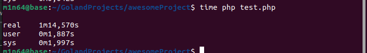
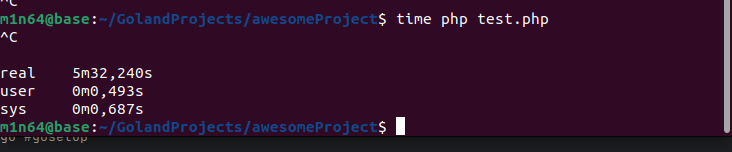

```shell
go get github.com/gorilla/mux
```
```shell
go get github.com/joho/godotenv
```
```shell
go get github.com/go-sql-driver/mysql
```
```shell
cp .env.example .env
```
Config DB connection in .env
```shell
go build main.go
```
```shell
chmod 777 main #optional
```
```shell
./main
```

POST _<YOUR_HOST>_:9099/api/v1/courier/trackGeo 

BODY: JSON 
```json
{
  "id": "HLKJ",
  "geo": {
    "lat": 12.22121,
    "lng": 13.23321,
    "hdn": 1.001,
    "acu": 1.222,
    "spd": 343,
    "stp": 5642872
  }
}
```
HEADERS 
```json
[
  { 
    "key":"Content-Type",
    "value":"application/json"
  },
  {
    "key":"Authorization",
    "value":"159f6dCourierSHA1TOKEN82ece32afdc"
    
  }
]
```
TEST GO SERVER (10000 requests):

TEST PHP (Yii 1) SERVER (~6500 REQUESTS):
